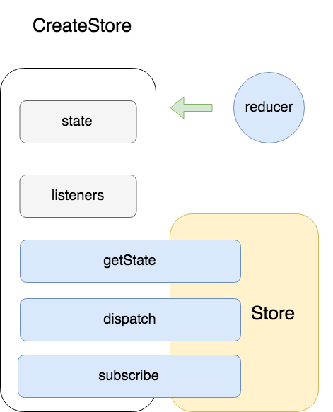

# 源码学习：Redux 之 createStore

## 序

分为4部分：

- 首先复习一下redux
- 然后进入引子，react和redux的苟合
- react-redux之Provider
- react-redux之connect

就酱

## 学习Redux 之 createStore

我们从redux的入口文件index可以看到它实际导出了这些

```
export {
  createStore,
  combineReducers,
  bindActionCreators,
  applyMiddleware,
  compose
}
```

**createStore**是redux的核心功能函数（c位），其他的函数都是小助手～。

我们平时是像这样简单使用createStore这个函数的：

```
const store = createStore(reducer,);
```
### 那么这个store是啥呢？

我们看源码里createS
store这个函数最后返回了什么：

```
  return {
    dispatch,
    subscribe,
    getState,
    ...
  }
```
一个对象，核心的三个方法我们通常比较熟悉的是dispatch和getState（如果你使使用过react+redux的组合），而从未见过subscibe，并不是没有用，而是react-redux帮我们使用了它（这个后面我们详细讲）。

### createStore这个文件是在做啥？

它创建了一个状态树，并且提供我们方法来读取当前的状态，改变状态，订阅状态改变。



上面return的那个对象就是暴露了这些方法给我们，

- getState方法提供的功能是读取当前状态树（银行！我现在存了多少钱？）

- dispatch提供的是改变状态树的功能，并且限制了改变的形式只能是action（我：银行我想存钱！银行：只收现金！不接受微信支付支付宝支付银行卡信用卡！）

- subscribe提供的功能是订阅状态树的改变（我开通了短信服务，钱的数量变了得通知我！）

当我们dispatch一个action的时候，就像是在跟银行说我要存100¥，然后给银行一张毛爷爷；银行（store）就查了查你当前的存款（state）0.5¥，然后给你加上100¥，生成了新的存款数100.5¥（new State），如果你开通了短信通知服务（subscribe），你的手机就会收到一条短信：您的redux store银行卡当前存款100.5¥。

### 那我们最开始传给createStore的参数reducer哪里去了？它做了什么？

reducer是告诉store当收到action的时候如何改变state生成新的state的。上面这个存钱例子是简化的版本，我来给你举个详细的例子：

银行是个不会算汇率的笨蛋，如果你存100美元，银行就不知道该给你的存款0.5¥加上多少钱，于是乎，热心市民你不得不告诉银行（reducer）：

```
const reducer = (state, action) => {
  const { type, payload } = action;
  switch (type) {
    case 人民币:
      return state + payload;
    case 美元:
      return  state + payload * 6.3;
    case 日元:
      return  state + payload * 0.058;
    ......
  }
};
```

如果是RMB，存款增加100¥；如果是美元，存款增加 100*6.3 ¥，如果是日元等等

### createStore是如何做到这些的呢？

我们看到subscribe会不会眼熟？内心OS八成是发布订阅模式吧.....实际上真的就是观察者模式！在不与react结合的时候，redux的工作流实际上是这样的，


#### 当我们写下这句`const store = createStore(reducer,);`的时候createStore做了什么呢？

- 它创建私有变量state用来存储状态树
- 创建了私有变量listeners 用来存放所有订阅者回调函数
- 定义dispatch,subscribe,getState
- 执行一个redux的初始化action，这样就会执行一遍所有的reducer将各自定义的初始状态存到store的状态树中。
- 将这些暴露出来的方法塞到一的对象返回


#### getState做了啥？
- 返回当前的state

#### dispatch(action)做了啥？

- dispatch将得到参数action和当前的state一起塞给了reducer，
- reducer就会计算出新的state，更新状态树state
- 通知listeners数组中的每个listener
- 返回action

#### subscribe(listener)做了啥？
- 把listener 塞到数组listeners里
- 返回一个unsubscribe函数

这个unsubscribe函数是用来取消订阅的，它里面做的事情就是从数组listeners中删掉listener。

### 小结


我们回过头看，其实redux跟我们DOM事件模型简直是亲兄弟。

subscribe（listener）就好比document.querySelector('button').addEventListener('click', listener); 注册了一个回调函数来监听click事件，当事件发生的时候通知我。

dispatch(action)就好比  document.querySelector('button').click()
主动去触发click事件

