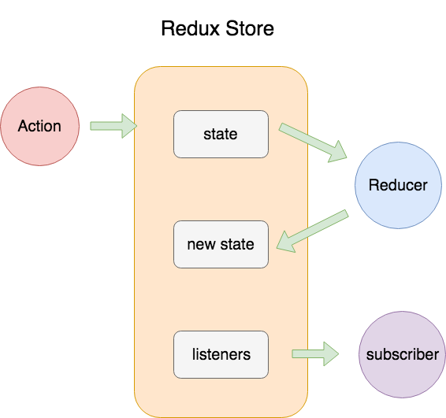
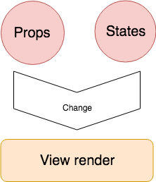
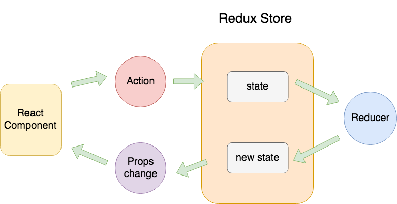

# 学习react与redux之全靠react-redux

### 我们已经知道了， redux的store维护的是一颗状态树，

### 而react的更新流程是props,或者state变化触发rerender从而更新视图。

### 当我们使用redux+react的时候，他俩是如何结合在一起的呢？
react组件订阅state的更新，当state变化的时候更新组件，从而引起视图更新。

这只是简单的一个概括，实际发生了更多的事情和优化，这些都是react-redux来实现的。

react-redux，我们主要使用的就是一个组件Provider和一个函数connect，

