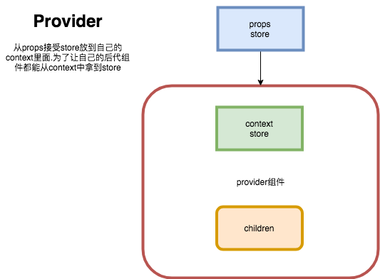
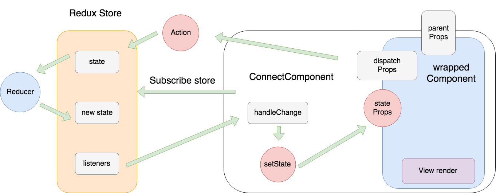
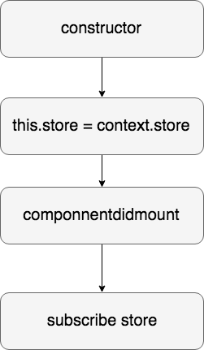
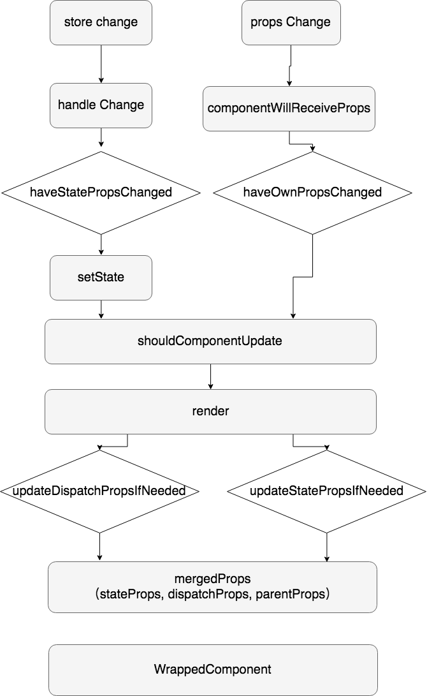

# 源码学习：react-redux 

## react-redux之Provider



一个简单的官网的使用例子是这样的

```
import React from 'react'
import { render } from 'react-dom'
import { Provider } from 'react-redux'
import { createStore } from 'redux'
import todoApp from './reducers'
import App from './components/App'
​
const store = createStore(todoApp)
​
render(
  <Provider store={store}>
    <App />
  </Provider>,
  document.getElementById('root')
)
```

可以看到Provider作为最外层的组件接受了一个store属性。他的作用就是让任何一个Provider的子孙组件都可以直接访问到store，那么他是如何实现的呢？

### 通过context实现的

```
class Provider extends Component {
        getChildContext() {
          return { store: this.store }
        }

        constructor(props, context) {
          super(props, context)
          this.store = props.store;
        }

        render() {
          return Children.only(this.props.children)
        }
    }
```

Provider组件接收的属props.store 存到this.store ,并且放到context中，这样子孙组件就能直接从context中访问store了。


可以理解为，就是放在了类似于一个全局变量里，并且不会引起react组件更新，也不需要一级一级传递，任何一个组件随时可以访问到。

但是，现在只是把store放到了一个恰当的位置，store是如何与react绑定的呢？ react组件是何时订阅了store的？如何只有自己关心的数据变化的时候才触发更新？

## react-redux 之connect
4.4.5版本connect这个函数只有一个connect.js文件，370行 。虽然跟5.0.5版本的connect比有点长，也没有5.0.5版本拆分的那么清晰，但是这个比较原始的版本功能比较单一，适合我们学习他的核心逻辑, 之后再去看新版本会更轻松一些。


首先，我们平时是这样使用connect的

```
const newComponent = connect(mapStateToProps, mapDispatchToProps)(WrappedComponent);
```
这种f( )( )题型，一看就是个高阶函数，我们来断一下句，分为两步 ，一点点分析。

```
// 首先 接收一些函数参数，返回一个函数
const connected = connect(mapStateToProps, mapDispatchToProps)
// 然后 接收一个组件，返回一个高阶组件
const newComponent = connected(WrappedComponent)
```
第一步，我们传递了两个函数参数：mapStateToProps，mapDispatchToProps。

> 复习一下：这俩函数一个表明我们要绑定到WrappedComponent上的state字段，store里数据千千万我只关心'dolls'字段！另一个表明了我们要绑定的用来改变'dolls'的数据的actionCreators比如‘dispatch(抓娃娃)’之类的。

最后我们会得到这个newComponent包含着WrappedComponent的高阶组件，我们关心的dolls字段和actionCreator都会作为props传给WrappedComponent组件。

```
<Connect(Component)>
    <WrappedComponent
        ...stateYouCared
        ...actionCreators
    />
</Connect(Component)>
```


### 问题1: state字段和actionCreators是怎么作为props传入到WrappedComponent的？

 有这样一个函数，它负责把stateProps、dispatchProps和父组件传递给`<Connect(Component)>`的props全合并到一起：
 
```
function computeMergedProps(stateProps, dispatchProps, parentProps) {
      ......
            return mergedProps
    }
```

然后呢，在`<Connect(Component)>`render的时候，就会将计算出最终的mergedProps传递给组件WrappedComponent。

```
return createElement(WrappedComponent,
            this.mergedProps
          )
```

### 问题2：store更新时是如何触发WrappedComponent组件更新的？



这些都是发生在高阶组件`<Connect(Component)>` 里的。


1.  首先在constructor中，从context里获取到store存下来，这就归功于Provider组件了。
2.  在`ComponentDidMount`的时候，会尝试订阅store

    ```
    this.store.subscribe(this.handleChange.bind(this))
    ```
    当store更新的时候，就会通知listener： handleChange

3.  handleChange中来判断haveStatePropsChanged来决定是否`this.setState({ storeState })`。

    这个地方是什么意思呢？store里存的数据很多比如

    ```
    store = { 
        dolls: ..., 
        money: ...,
        ...
    }
    ```
    在当前组件我们只绑定的是dolls的数据，如果money的数据变化了，store一样会通知我们，但其实我们并不关心它，也不想更新视图，因此handleChange中会调用 this.updateStatePropsIfNeeded得知本组件关心的那部分state数据（dolls）是否变化了， 如果变化了才会将新的`storeState = this.store.getState() `数据更新：`this.setState({ storeState })` 
  

  然后就会进入shouldComponentUpdate之后的流程。

4. 在shouldComponentUpdate中又判断了一次是否真的需要update本组件。

  ```
  shouldComponentUpdate() {
          return !pure || this.haveOwnPropsChanged || this.hasStoreStateChanged
        }
  ```
5. 进入render函数，这个函数里就执行了上文的 MergedProps的操作，然后塞给WrappedComponent。

当组件`<Connect(Component)>` 接收的props改变的时候，也会在componentWillReceiveProps中做了优化，之后的流程跟上面就一样了。


### 总结
其实connect这个函数接收了一些参数和组件生成了一个高阶组件，订阅store来更新视图，我们可以发现它是做了很多优化的，来避免频繁和不必要的更新。

等到5.0.5版本的react-redux的时候，又进一步优化和丰富了connect的功能，大家感兴趣可以去研究一下。

最后附上一张我学习的时候画的connect的流程图,图很大，所以存成了svg格式，可以放大来看。

